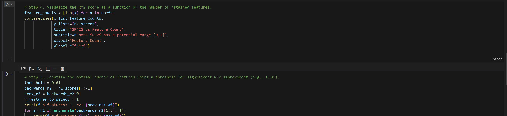

# Assignment 1

The notebook should only need `matplotlib`, `scikit-learn`, `numpy`, and `pandas` installed in the python environment to work.

The notebook references fig_helpers.py which contains functions I wrote for automatic plotting with matplotlib. Make sure that fig_helpers.py is in the same directory as the notebook if you decide to download individually.

I have been using the Jupyter Notebook extension in VSCode to run my notebook, but it should work anywhere, so long as the assosciated file is present.

