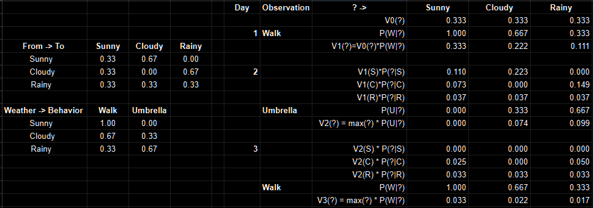

# Quiz 2

If you're viewing in the GitHub website, look at the [Quiz 2 notebook](MDP.todo.ipynb), and if you're downloading to view, open the [exported html writeup](Quiz2_jbcollins.html).

The [spreadsheet table for HMM](forward_back_tracing.png) doesn't load in the GitHub ipynb preview, so it's here, too:

